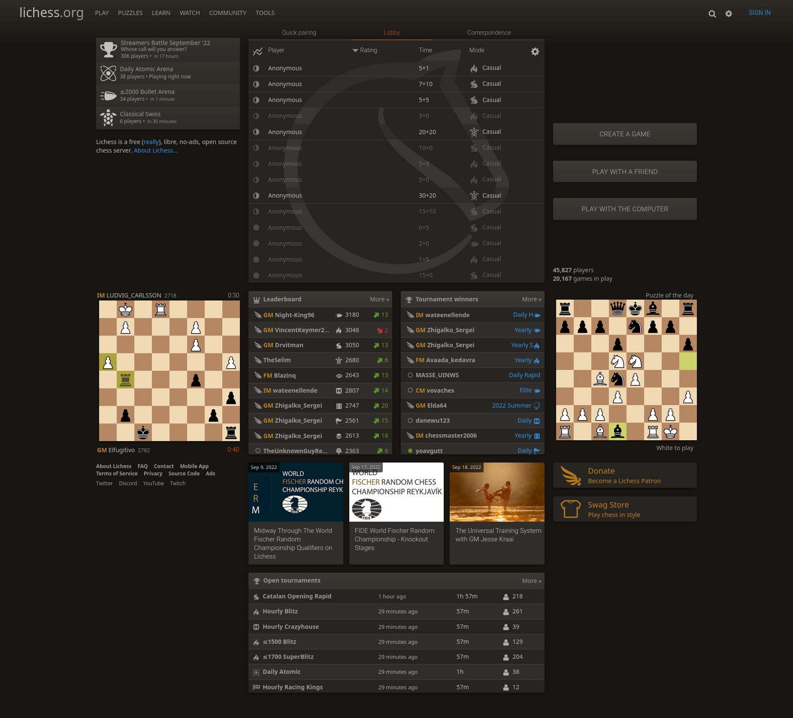
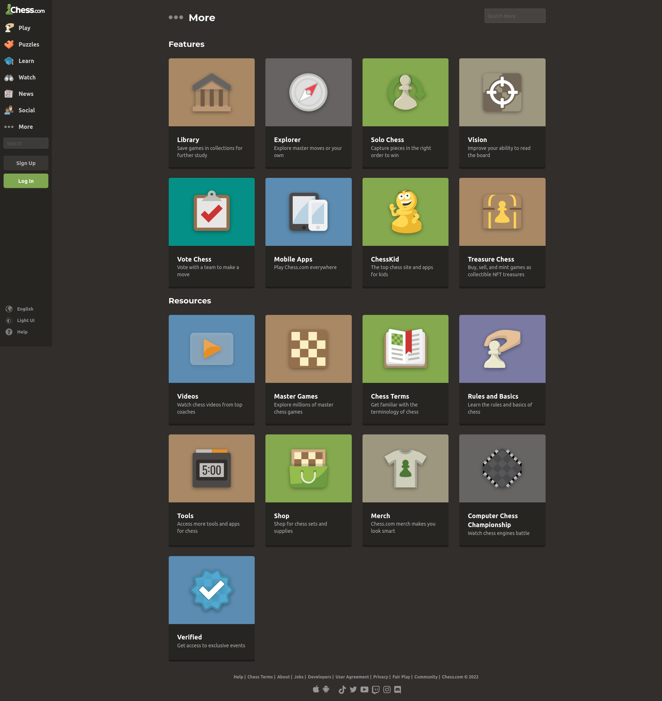

# Cheesy
## Project
Cheesy is a chess program in which users can play the best, most *awesome* game that is chess, without all of the extra hassle that most chess programs have. I noticed when exploring the popular options for chess that most of them have a variety of what I deem unnecessary features. Some particular ones that seemed common included *user accounts*, *bloated ui* and *confusing design choices*. For most users, these decisions can be a deterrence. If one is seeking to play chess and only chess, they don't need a news section, or a ton of information on the main page. All that's needed is to simply *run* the program, see some buttons that offer to play alone, with a bot, etc., and to be able to get into a game. Thus, this is exactly what I had in mind when designing my project: a chess program that's *easy* to pick up and play, even for new players or those who aren't very tech-savvy.

Its feature set will contain all of the handy functions that a typical chess program has but without all of the bloat. Players will be able to:
- Immediately hop into a game from the main screen,
- Can be played either alone, with a buddy locally, or online,
- A unique *randomizer variant* where each pieces' movement options are randomly selected from all the different pieces' legal moves.
    - Can be configured to randomize only at game start, or perhaps after every turn.
    - Every game will be different!

## Languages/Frameworks
After looking through a variety of frameworks, I settled on working with [Electron][1] `[1]`. It's a framework that uses a stripped-down *chromium* browser along with *Node.js*, meaning it will use Javascript, CSS and HTML. I'm interested in learning more Node.js, as from what I understand it is a useful skill to have. With Javascript as my coding language, I'll have access to some useful libraries for my chess application. [Chessboard.js][2] `[2]` paired with [Chess.js][3] `[3]` seem like they will be very helpful. The board is fully customizable with a powerful API. The documentation for it is extensive and readable, showing multiple examples on using and customizing boards. Further, it seems rather easy to embed in my project. The chess.js library claims it has code for up to everything except AI. It has a well-documented API and it's headless, making it very easy to integrate with chessboard.js. I decided to make my program a desktop application to make getting into a game of chess as *quick* and *seamless* as possible. Instead of having to search the web for a chess program, users can simply boot up the game from their desktop or wherever they have it stored and immediately get into a game. Additionally, unlike other popular options like *Lichess* or *Chess.com*, it doesn't even matter if one doesn't have internet access at the time, as it is a desktop app. Thus, users can even use Cheesy offline. Some other honorable framework mentions include: 
1. [Tauri][4] `[4]` a Rust framework for fast applications,
2. [Neutralino][5] `[5]`, a light alternative to Electron, and
3. [Xojo][6] `[6]`, a beginner friendly drag-and-drop framework.

 These are all solid frameworks, but they all miss the mark in some way when compared to the well-established Electron. 
 - *Tauri* was an interesting option; it allows one to use any front-end framework alongside itself, it makes very quick applications in Rust, and it has a security team that regularly releases security patches to protect from cyber attacks. However, it has a limitation in the sense that it requires the application to be less than 600 KB in size. I decided against it due my lack of experience with Rust and worries about the the size limitation. I'm not concerned about how large my application is, so that doesn't make it more appealing to me than Electron.
 - *Neutralino* presents itself as an alternative to Electron, as Neutralino is similar in features, but with less bulk. It also comes with a native API and a library using a light SDK. It's flexible with other front-end and/or back-end frameworks. I chose Electron over this alternative because I don't quite need such flexibility nor am I concerned about Electron's bulkiness. Moreover, Electron as a framework is far more established and matured. Node.js, which is built into Electron, contains a huge ecosystem of useful libraries for me to use. While Neutralino can use this as well, it isn't natively embedded into the framework.
 - *Xojo* is a beginner-friendly framework with a drag-and-drop interface, along with some handy features. It's compatible with protocols, has database and graphic support and a rapidly growing community. With its ease of use, i was considering this as an option. I worried it wouldn't have everything I needed because of its simplicity. It also isn't entirely cross-platform, causing me to lean more towards Electron.
 
## Competing Products
### **Lichess**

#### Description
[Lichess][7] `[7]` is a very popular chess program for a variety of players. It is a web-based application that presents itself as a one-stop site for all things chess: *news*, *tournaments*, *coaching*, *match analysis*, *puzzles*, etc.. It's also open-source and under the [AGPL license](https://en.wikipedia.org/wiki/GNU_Affero_General_Public_License). Users of Lichess can play games with random people or friends online, as well as train their skills against a powerful AI that can be adjusted based on one's *elo*. The coaching system is quite extensive, allowing users to request help from excellent players or to provide their own expertise for others. Further, users can make an account to track their progress. They can then use this tracking to assess their skill level and be matched with those of similar skill; or, they can complete puzzles or train against an AI of similar level.

#### Comparison
Lichess is a solid choice for users wanting a web-based chess application that provides more than enough features for playing chess; In contrast, my program will be a solid choice for users wanting a *desktop application* that will have as many features as *necessary* and only that many. The myriad of options to choose from only serve to bloat the screen and make it less accessible to some users, like new players just wanting to play a game of chess. I believe the average user of a chess program won't need coaching, news, puzzles, tournaments, etc.. I won't be making any sort of account system, as I find users can be deterred from a program as soon as it asks them to make an account. All these measures will ensure that users will easily understand how to use my application and won't be deterred from choice overload. Additionally, my application being of the desktop variety allows users to install the program onto their own device. This decision was made to set my program apart from the other very solid, web-based options. Being a desktop app, users don't have to worry about not having internet access, or running a full browser in the background. It will be runnable regardless, with only some features requiring internet access, like playing online. Rathe than having to learn how to navigate a specific webpage, users cna just run an executable and be greeted with a streamlined interface. It will also be easier to guarantee security, as it is on the machine itself and not directly exposed to the internet.

### **Chess.com**

[Chess.com][8] `[8]` is another popular chess program, perhaps even more than Lichess due to the disparity in player count. Lichess, as of this viewing, had 41,000 players compared to chess.com's 216,000. Its feature set is similar to Lichess in that there are a lot of cool tools for experienced users to take advantage of, but to any other user it can just result in confusion. It also requires an account to be set up for a user to play any sort of variant, a feature I will definitely not be making. Users would easily be discouraged from a program if it requires an account to be made to use certain features.

## References

[1] C. Zhao, “Electron: Build cross-platform desktop apps with JavaScript, HTML, and CSS.,” Electron Blog RSS. [Online]. Available: https://www.electronjs.org/. [Accessed: 22-Sep-2022].

[2] “Chessboard.js,” chessboardjs.com " Homepage. [Online]. Available: https://chessboardjs.com/. [Accessed: 22-Sep-2022].

[3] Jhlywa, “Jhlywa/chess.js: A Javascript Chess Library for chess move generation/validation, piece placement/movement, and check/checkmate/draw detection,” GitHub. [Online]. Available: https://github.com/jhlywa/chess.js. [Accessed: 22-Sep-2022].

[4] “Build smaller, faster, and more secure desktop applications with a web frontend: Tauri Apps,” Tauri Apps RSS. [Online]. Available: https://tauri.app/. [Accessed: 22-Sep-2022].

[5] “Build lightweight cross-platform desktop apps with JavaScript, HTML, and CSS: Neutralinojs,” Neutralinojs Blog RSS. [Online]. Available: https://neutralino.js.org/. [Accessed: 22-Sep-2022]. 

[6] G. Perlman, “Build native, cross-platform apps,” Xojo. [Online]. Available: https://www.xojo.com/. [Accessed: 22-Sep-2022].

[7] T. Duplessis, “The best free, adless chess server,” lichess.org. [Online]. Available: https://lichess.org/. [Accessed: 18-Sep-2022].

[8] E. Allebest, “Play chess online - free games,” Chess.com. [Online]. Available: https://www.chess.com/. [Accessed: 18-Sep-2022].

[1]: https://www.electronjs.org/
[2]: https://chessboardjs.com/
[3]: https://github.com/jhlywa/chess.js
[4]: https://tauri.app/
[5]: https://neutralino.js.org/
[6]: https://www.xojo.com/
[7]: https://lichess.org/
[8]: https://www.chess.com/